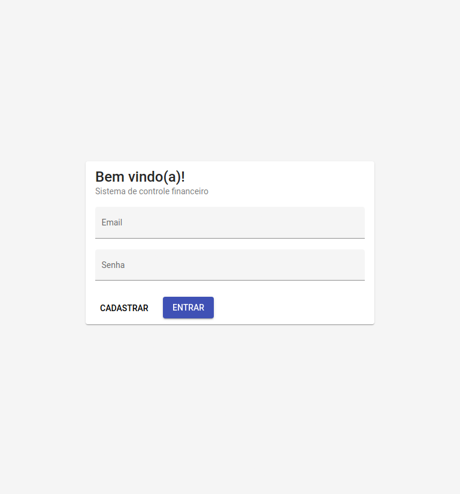

<h3 align="center">
    <b>Projeto da disciplina de Engenharia de Software</b>  
    <br><br>
    <b>Administrador de Finanças</b>  
    <br>
</h3>

# Índice

- [Sobre](#sobre)
- [Tecnologias Utilizadas](#tecnologias-utilizadas)
- [Como Usar](#como-usar)
- [Como Contribuir](#como-contribuir)

<a id="sobre"></a>

## :bookmark: Sobre

O <strong>Administrador de Finanças</strong> é uma aplicação Web, desenvolvida durante a disciplina de Engenharia de Software, do Centro de Informática da Universidade Federal de Pernambuco, tendo em vista desenvolver e colocar em prática os conhecimentos adquiridos durante a disciplina.

<a id="tecnologias-utilizadas"></a>

## :rocket: Tecnologias Utilizadas

O projeto foi desenvolvido utilizando as seguintes tecnologias

- [TypeScript](https://www.typescriptlang.org/)
- [Node.js](https://nodejs.org/en/)
- [Angular](https://angular.io/)
- [Firebase](https://firebase.google.com/)

## :heavy_check_mark: :computer: Tela de login

<h1 align="center">
    
</h1>

## :heavy_check_mark: :computer: Tela de Home

<h1 align="center">
    
</h1>

## :heavy_check_mark: :computer: Tela de Fontes de Renda

<h1 align="center">
    
</h1>

## :heavy_check_mark: :computer: Tela de Gastos Fixos

<h1 align="center">
    
</h1>

<a id="como-usar"></a>

## :fire: Como usar

- ### **Pré-requisitos**

  - É **necessário** possuir o **[Node.js](https://nodejs.org/en/)** instalado na máquina
  - Também, é **preciso** ter um gerenciador de pacotes seja o **[NPM](https://www.npmjs.com/)**.

1. Faça um clone :

```sh
  $ git clone https://github.com/MatheusAlvesAlmeida/ProjetoESS---AdmFinancas
```

2. Executando a Aplicação:

```sh
  # Instale as dependências no frontend
  $ cd admFinancas
  $ npm install
  # Instale as dependências no backend
  $ cd backend
  $ npm install

  # Inicie o frontend
  $ cd admFinancas
  $ npm start

  # Inicie o backend
  $ cd backend
  $ npm start

```

<a id="como-contribuir"></a>

## :recycle: Como contribuir

- Faça um Fork desse repositório,
- Crie uma branch com a sua feature: `git checkout -b my-feature`
- Commit suas mudanças: `git commit -m 'feat: My new feature'`
- Push a sua branch: `git push origin my-feature`

## :mortar_board: Quem desenvolveu?

O projeto foi desenvolvido por **[Gabriel Nogueira](https://github.com/gabrielnogueiralt)** e por **[Matheus Alves](https://github.com/MatheusAlvesAlmeida)**

## :memo: License

Esse projeto está sob a licença MIT. Veja o arquivo [LICENSE](LICENSE.md) para mais detalhes.

---
